# Finalized Cinemesh ERD & Data Governance

This document contains the 100% accurate, production-ready Entity Relationship Diagram (ERD) for the Cinemesh movie ticket booking system. It reflects the exact JPA entity structures, including `BaseEntity` inheritance, many-to-many join tables, and Outbox log relationships.

---

## 1. Unified Entity Relationship Diagram (ERD)

**Legend:**
- **[BaseEntity Fields]**: Every table inherits `id (UUID PK)`, `created_at (Instant)`, `modified_at (Instant)`, `created_by (String)`, `modified_by (String)`.
- **Solid Lines (--|{)**: Physical Foreign Keys within a service database.
- **Dashed Lines (..|{)**: Logical/Soft Foreign Keys across service boundaries.

```mermaid
erDiagram
    %% ==========================================
    %% 1. AUTH SERVICE (cinemesh_auth_db)
    %% ==========================================
    USERS {
        UUID id PK
        INSTANT created_at
        INSTANT modified_at
        STRING created_by
        STRING modified_by
        STRING email UK
        STRING password
        STRING full_name
        STRING phone
        DATE dob
        STRING gender
        STRING avatar_url
        ENUM status "ACTIVE, LOCKED, INACTIVE"
    }
    ROLES {
        UUID id PK
        INSTANT created_at
        INSTANT modified_at
        STRING created_by
        STRING modified_by
        ENUM name UK "ROLE_ADMIN, ROLE_CUSTOMER"
    }
    USER_ROLES {
        UUID user_id PK, FK
        UUID role_id PK, FK
    }
    REFRESH_TOKENS {
        UUID id PK
        INSTANT created_at
        INSTANT modified_at
        STRING created_by
        STRING modified_by
        UUID user_id FK
        STRING token UK
        ENUM status "ACTIVE, INACTIVE"
    }
    USER_LOGS {
        UUID id PK
        INSTANT created_at
        INSTANT modified_at
        STRING created_by
        STRING modified_by
        UUID userId FK
        ENUM type "CREATE, MODIFY"
        TEXT detail
    }

    USERS ||--o{ REFRESH_TOKENS : "manages"
    USERS ||--o{ USER_ROLES : "assigned"
    ROLES ||--o{ USER_ROLES : "attached"
    USERS ||--o{ USER_LOGS : "logs events"

    %% ==========================================
    %% 2. MOVIE SERVICE (cinemesh_movie_db)
    %% ==========================================
    MOVIES {
        UUID id PK
        INSTANT created_at
        INSTANT modified_at
        STRING created_by
        STRING modified_by
        STRING title_en
        STRING title_vn
        TEXT description
        INT duration_minutes
        DATE release_date
        STRING poster_url
        STRING trailer_url
        STRING directors
        STRING actors
        ENUM rated "G, PG, PG_13, R, NC_17"
        ENUM status "COMING_SOON, NOW_SHOWING, ENDED"
    }
    MOVIE_GENRES {
        UUID id PK
        INSTANT created_at
        INSTANT modified_at
        STRING created_by
        STRING modified_by
        STRING name
    }
    MOVIE_MOVIE_GENRES {
        UUID movie_id PK, FK
        UUID movie_genre_id PK, FK
    }
    MOVIE_LOGS {
        UUID id PK
        INSTANT created_at
        INSTANT modified_at
        STRING created_by
        STRING modified_by
        UUID movieId FK
        ENUM type "CREATE, MODIFY"
        TEXT detail
    }

    MOVIES ||--o{ MOVIE_MOVIE_GENRES : "has"
    MOVIE_GENRES ||--o{ MOVIE_MOVIE_GENRES : "categorizes"
    MOVIES ||--o{ MOVIE_LOGS : "logs changes"

    %% ==========================================
    %% 3. THEATER SERVICE (cinemesh_theater_db)
    %% ==========================================
    ROOMS {
        UUID id PK
        INSTANT created_at
        INSTANT modified_at
        STRING created_by
        STRING modified_by
        STRING name UK
        INT total_seats
        ENUM status "CREATED, ACTIVE, MAINTENANCE"
    }
    SEATS {
        UUID id PK
        INSTANT created_at
        INSTANT modified_at
        STRING created_by
        STRING modified_by
        UUID room_id FK
        STRING row_code
        INT column_number
        ENUM type "STANDARD, VIP, COUPLE"
    }
    SHOW_TIMES {
        UUID id PK
        INSTANT created_at
        INSTANT modified_at
        STRING created_by
        STRING modified_by
        UUID movie_id "Logical FK"
        UUID room_id FK
        DATETIME start_time
        DATETIME end_time
        DECIMAL base_price
        ENUM status "CREATED, SHOWING, SHOWN"
    }
    ROOM_LOGS {
        UUID id PK
        INSTANT created_at
        INSTANT modified_at
        STRING created_by
        STRING modified_by
        UUID roomId FK
        ENUM type "CREATE, MODIFY"
        TEXT detail
    }
    SHOW_TIME_LOGS {
        UUID id PK
        INSTANT created_at
        INSTANT modified_at
        STRING created_by
        STRING modified_by
        UUID showtime_id FK
        ENUM type "CREATE, MODIFY"
        TEXT detail
    }

    ROOMS ||--o{ SEATS : "contains"
    ROOMS ||--o{ SHOW_TIMES : "hosts"
    ROOMS ||--o{ ROOM_LOGS : "room history"
    SHOW_TIMES ||--o{ SHOW_TIME_LOGS : "showtime history"
    MOVIES ||..o{ SHOW_TIMES : "Logical Reference"

    %% ==========================================
    %% 4. BOOKING SERVICE (cinemesh_booking_db)
    %% ==========================================
    ORDERS {
        UUID id PK
        INSTANT created_at
        INSTANT modified_at
        STRING created_by
        STRING modified_by
        UUID user_id "Logical FK"
        DECIMAL total_amount
        ENUM payment_status "PENDING, PAID, FAILED, REFUNDED"
        ENUM status "PENDING, PAID, CANCELLED, FAILED, REFUNDED"
        INT version
    }
    TICKETS {
        UUID id PK
        INSTANT created_at
        INSTANT modified_at
        STRING created_by
        STRING modified_by
        UUID order_id FK
        UUID showtime_id "Logical FK"
        UUID seat_id "Logical FK"
        DECIMAL price
        ENUM status "RESERVED, BOOKED, CANCELLED"
    }
    ORDER_LOGS {
        UUID id PK
        INSTANT created_at
        INSTANT modified_at
        STRING created_by
        STRING modified_by
        UUID orderId FK
        ENUM type "CREATE, MODIFY"
        TEXT detail
    }

    ORDERS ||--o{ TICKETS : "items"
    ORDERS ||--o{ ORDER_LOGS : "process audit"
    USERS ||..o{ ORDERS : "Logical Order Owner"
    SHOW_TIMES ||..o{ TICKETS : "Logical Showtime"
    SEATS ||..o{ TICKETS : "Logical Seat"

    %% ==========================================
    %% 5. PAYMENT SERVICE (cinemesh_payment_db)
    %% ==========================================
    PAYMENTS {
        UUID id PK
        INSTANT created_at
        INSTANT modified_at
        STRING created_by
        STRING modified_by
        UUID order_id "Logical FK"
        DECIMAL amount
        DECIMAL paid_amount
        ENUM currency "VND, USD"
        ENUM payment_partner "VN_PAY, MOMO, PAYPAL"
        STRING transaction_id UK
        ENUM status "PENDING, PAID, FAILED, REFUNDED"
    }
    PAYMENT_NOTIFICATIONS {
        UUID id PK
        INSTANT created_at
        INSTANT modified_at
        STRING created_by
        STRING modified_by
        ENUM payment_partner "VN_PAY, MOMO, PAYPAL"
        TEXT raw_payload
        ENUM status "UNPROCESSED, PROCESSED, FAILED"
        TEXT error_log
    }
    PAYMENT_LOGS {
        UUID id PK
        INSTANT created_at
        INSTANT modified_at
        STRING created_by
        STRING modified_by
        UUID paymentId FK
        ENUM type "CREATE, MODIFY"
        TEXT detail
    }

    ORDERS ||..o{ PAYMENTS : "Logical Payment Link"
    PAYMENTS ||--o{ PAYMENT_LOGS : "payment audit"
```

---

## 2. Architectural Highlights

- **BaseEntity Compliance**: All 18+ tables include the 5 standard auditing columns: `id`, `created_at`, `modified_at`, `created_by`, `modified_by`.
- **Many-to-Many Mappings**: Join tables `user_roles` and `movie_movie_genres` are explicitly modeled to represent the N-N relationships correctly.
- **Transactional Outbox**: Each core entity has a dedicated `_logs` table (e.g., `ORDER_LOGS`). These tables share a 1:N physical relationship with their parent entities to track state changes for Debezium event streaming.
- **Decoupled Identity**: Cross-service relationships (e.g., `ORDERS` referencing `USERS`) use dashed lines and are managed logically via UUIDs rather than database constraints, preserving microservice autonomy.
